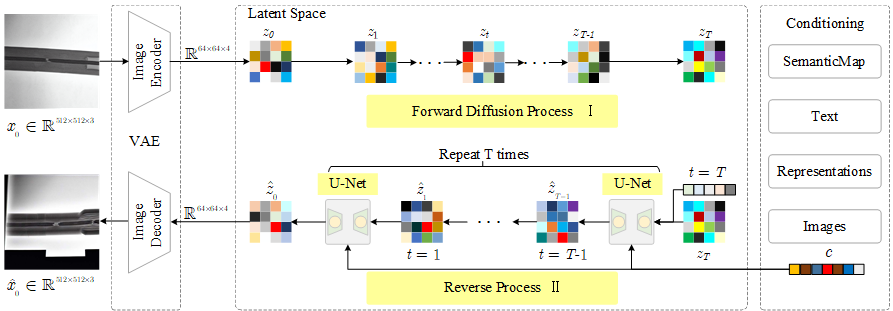
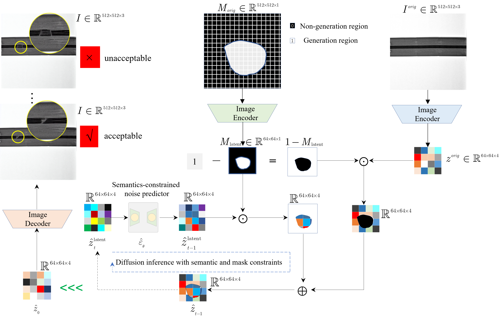
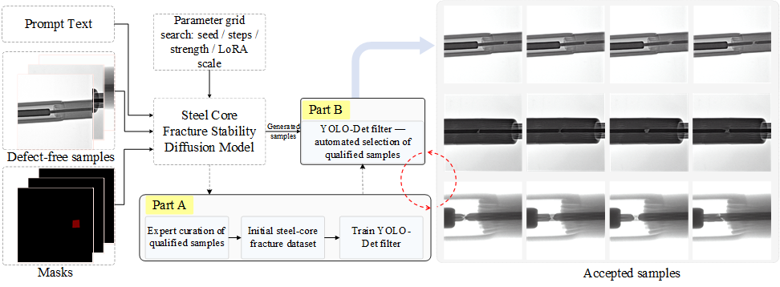
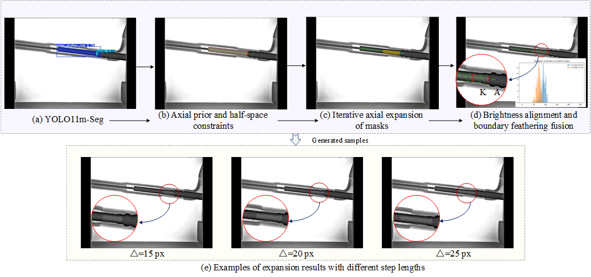
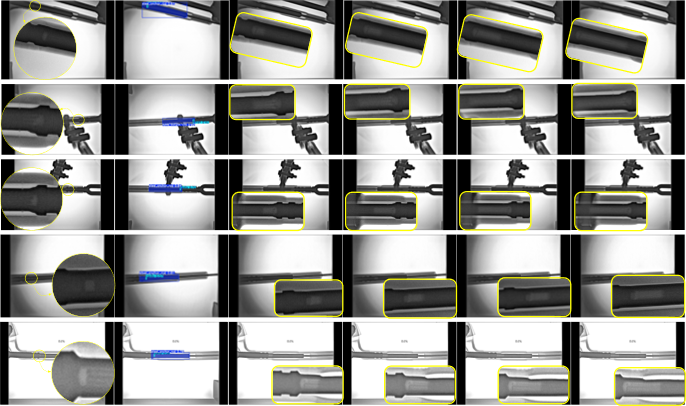

# SLGP-DA: Structure-Prior Guided Dual-Path X-ray Data Augmentation (SLMY + GPPL)

This repository presents the implementation of **SLGP-DA**, a **Structure-Prior Guided Dual-Path X-ray Data Augmentation** framework for rare defect learning in industrial DR inspection of power transmission compression fittings. The framework couples **physical imaging priors** with **generative AI**, and provides an end-to-end pipeline covering:

- **SLMY branch (Fracture synthesis)**: Stable Diffusion + LoRA with **mask-constrained local synthesis** and **YOLO-based posterior filtering**.
- **GPPL branch (Cavity expansion)**: **PCA axial prior** + **half-space constraint** + **axial stepwise growth** with **photometric alignment** and **boundary feather blending**.
- **Boundary continuity evaluation**: ΔG (boundary gradient difference) and ΔC (local contrast difference) for clean vs augmented consistency assessment.
- **YOLO11m-OBB full chain**: downstream OBB detection and a Qt-based visualization/grading tool.

> Note: Industrial DR datasets and trained weights may be restricted and are NOT included by default. This repository provides reproducible code structure, configuration conventions, and usage guidance for academic verification.

---

## 📊 Architecture Overview

### ▶ SLGP-DA Dual-Path Framework (Fig. 5)

> Figure 5: Overall structure-prior guided dual-path augmentation framework (SLMY for fracture synthesis, GPPL for cavity expansion) and its integration with downstream detection.

---

### ▶ SLMY Branch: Mask-Constrained Local Synthesis (Fig. 10–11)

> Figure 10: Mask-constrained local synthesis mechanism in the latent space.

> Figure 11: SLMY pipeline including LoRA prior injection, mask-guided synthesis, and YOLO-based posterior screening.

---

### ▶ GPPL Branch: Axial Prior & Half-Space Constrained Expansion (Fig. 12)

> Figure 12: GPPL workflow including segmentation, PCA axis estimation, half-space constraint, stepwise axial expansion, photometric alignment, and blending.

---

### ▶ Dual-Branch Qualitative Results (Fig. 14–15)

<table>
  <tr>
    <td align="center">
      
       <b>Fig. 14(a)</b>
    </td>
    <td align="center">
      
       <b>Fig. 14(b)</b>
    </td>
  </tr>
</table>

> Figure 14: Representative qualitative results of dual-path augmentation. (a) [caption aligned with the paper]. (b) [caption aligned with the paper].

> Figure 15: Additional qualitative results demonstrating geometric and photometric consistency.

---

## 🧰 System Requirements

| Component        | Version / Notes |
|------------------|------------------|
| Operating System | Linux / Windows (Linux recommended for diffusion workloads) |
| Python           | 3.8+ (3.10 recommended) |
| Diffusion (SLMY) | diffusers + transformers + accelerate + torch (GPU recommended) |
| Perception/Detection | ultralytics (YOLO11 series: Det / Seg / OBB as used in the paper) |
| Image Processing | OpenCV, NumPy, Pillow |
| GUI              | PyQt6 (for the OBB visualization/grading tool) |
| Optional Plotting | Matplotlib (for GPPL histogram/diagnostics if enabled) |

---

## 🚀 Quick Start Guide

### 1️⃣ Prepare Repository Structure

Please place paper figures under:
- `SLGP-DA/RE_IMAGE/` with filenames: `Fig5.png`, `Fig10.png`, `Fig11.png`, `Fig12.png`, `Fig14a.png`, `Fig14b.png`, `Fig15.png`.

Recommended repository layout:
- `src/` for core scripts (SLMY / GPPL / ΔGΔC / GUI)
- `weights/` for LoRA and YOLO model weights
- `data/` for datasets following the conventions below
- `outputs/` for generated samples, metrics CSVs, logs, and visualization results

---

### 2️⃣ Data Conventions (Important for Reproducibility)

This repository supports two types of data conventions:

**(A) SLMY input (mask-constrained synthesis)**
- Each sample should provide a **base DR image** and a corresponding **binary mask** indicating candidate synthesis regions.
- If using Labelme-style exports, group each sample into a folder with consistent naming (e.g., `xxx_json/` containing `img.*` and `label.*`).

**(B) ΔG/ΔC evaluation input (naming alignment)**
- Masks are indexed by a leading integer ID (e.g., `1_mask_used.png`).
- Clean images share the same leading ID (e.g., `1.png`).
- Generated images also share the same leading ID (e.g., `1_*.png`).
- This ensures “same-location” evaluation between clean and augmented samples.

**(C) GPPL input**
- Provide seed images containing cavity/under-insertion regions.
- Segmentation outputs (steel + cavity masks) are used to estimate PCA axis and apply constrained axial growth.

**(D) YOLO11m-OBB downstream dataset**
- Standard YOLO dataset structure is recommended (train/val/test splits).
- OBB label format should match your chosen YOLO11 implementation.

---

### 3️⃣ Run the Core Pipelines (No-Code Overview)

#### 3.1 SLMY (Fracture Synthesis)
- Load a Stable Diffusion base model with LoRA weights.
- Perform mask-constrained local synthesis for each candidate region.
- Sweep key control factors (e.g., LoRA scale, strength, random seed) to increase diversity.
- Apply YOLO-based posterior filtering to reject low-consistency samples.
- Export accepted images into a structured output folder for downstream training.

**Key controllable parameters (recommended to report in the paper):**
- Base model (e.g., SD v1.5)
- Image resolution (e.g., 512×512)
- Training batch strategy and effective batch size (if LoRA is trained)
- Learning rate, scheduler, warm-up steps, total steps (if LoRA is trained)
- LoRA rank and alpha
- Inference controls (sampling steps, CFG scale)
- Posterior filtering threshold (minimum confidence) and accepted classes
- Sampling budget per image (target number of qualified samples)

---

#### 3.2 GPPL (Cavity Expansion)
- Segment steel anchor and cavity regions to obtain masks.
- Compute PCA principal axis of the steel anchor region.
- Enforce half-space constraint to restrict physically plausible growth direction.
- Apply stepwise axial expansion with a defined step length and number of steps.
- Align gray-scale statistics via photometric alignment (e.g., median-based).
- Apply boundary feather blending to smooth transitions and reduce artifacts.
- Export intermediate visualizations (optional) and final augmented images.

**Key controllable parameters (recommended to report in the paper):**
- Segmentation weights/version
- PCA axis estimation details (mask preprocessing, axis direction unification)
- Step length (pixels) and number of steps
- Half-space constraint rule
- Photometric alignment parameters
- Feathering radius (pixels)

---

#### 3.3 Boundary Continuity Evaluation (ΔG / ΔC)
- Compute boundary gradient difference ΔG within a narrow band around defect boundaries.
- Compute local contrast difference ΔC within the same band.
- Perform clean vs augmented comparison using matched boundary locations.
- Export per-sample results into a CSV for statistical testing and plotting.

**Key controllable parameters (recommended to report in the paper):**
- Boundary band radius (pixels)
- Gradient operator settings (e.g., Sobel magnitude)
- Contrast definition (e.g., RMS contrast)
- Candidate boundary sampling protocol (same-location principle)

---

#### 3.4 YOLO11m-OBB Full Chain (Training + GUI)
- Train a YOLO11m-OBB detector on clean-only vs augmented datasets to quantify gains.
- Evaluate standard detection metrics (mAP, IoU-related measures) and compare against baselines.
- Use the Qt GUI tool for inference visualization, qualitative inspection, and grading integration (if enabled).

**Key controllable parameters (recommended to report in the paper):**
- Model variant (YOLO11m-OBB)
- Input size, epochs, batch size, optimizer/schedule (as applicable)
- Confidence threshold, IoU threshold, inference image size (for GUI/visualization)

---

## 🧠 Models and Resources

Recommended weight placement:
- LoRA weights: `weights/lora/`
- YOLO detection (posterior filtering): `weights/yolo11m_det.pt`
- YOLO segmentation (GPPL): `weights/yolo11m_seg.pt`
- YOLO OBB (downstream): `weights/yolo11m_obb.pt`

> If you cannot redistribute weights, please document the acquisition method (official release link / training procedure) in an internal note.

---

## 📎 Supplementary Materials

- Paper figures used in this repository are placed in `RE_IMAGE/`.
- Additional experimental logs, ablation results, or demonstration media can be linked here if needed.

---

## 📄 License

This project is released under the [MIT License](LICENSE).

---

Feel free to cite or reuse this project for academic and research purposes.  
Issues and contributions are welcome.
